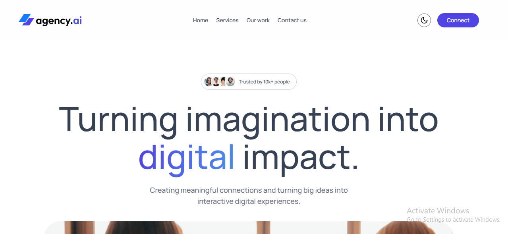
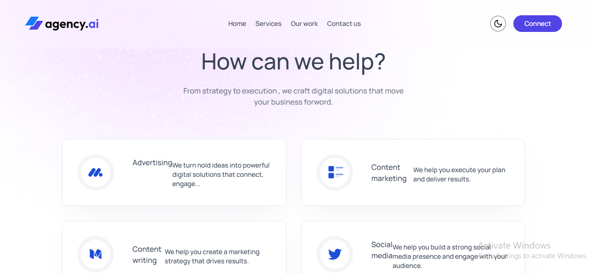
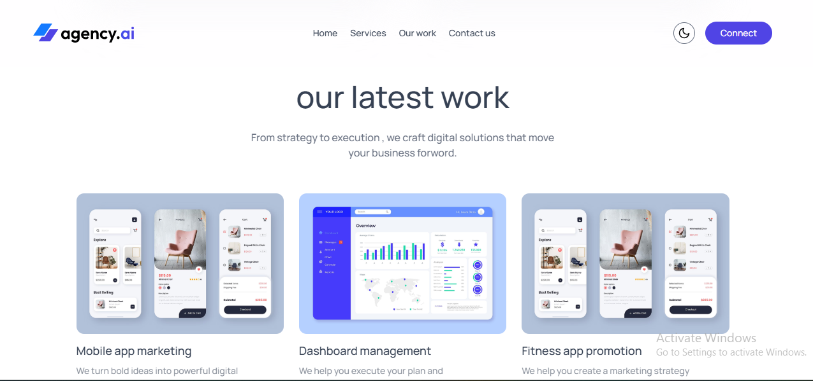
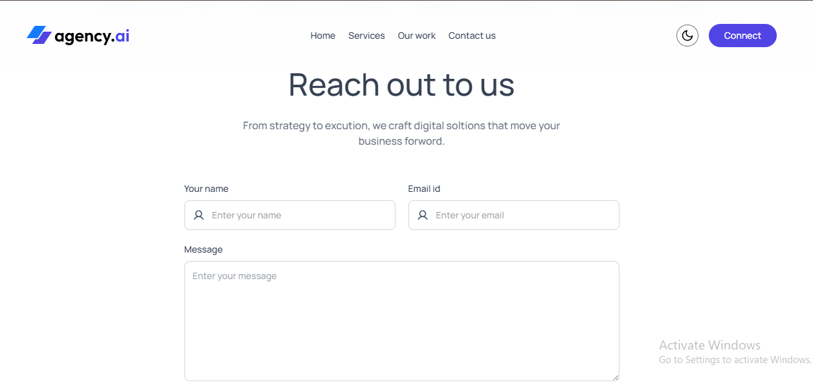

# 🚀 AgencyAI – Digital Agency Website

AgencyAI is a modern, responsive digital agency website designed to showcase services, portfolio work, and client interaction with a clean and professional UI.  
The project includes a **Light / Dark theme toggle** and focuses on smooth user experience and scalable frontend architecture.

## 🌐 Live Preview

🔗 https://agency-ai-pg.vercel.app/

## 🛠 Tech Stack

- **HTML5** – Semantic and accessible structure  
- **Tailwind CSS** – Utility-first styling & responsive design  
- **JavaScript (ES6+)** – Dynamic functionality  
- **React.js** – Component-based UI development  
- **Vite** – Fast development server & optimized build  

## ✨ Key Features

- Modern landing page with strong visual branding  
- Light & Dark mode theme toggle  
- Services section explaining offerings  
- Portfolio / latest work showcase  
- Contact form UI for client interaction  
- Fully responsive across all devices  
- Clean, reusable React components  

## 🎨 Theme Preview

### 🏠 Home Page

## 📸 Website Sections

### 🧩 Services

---

### 💼 Our Latest Work

---

### 📬 Contact Us

📌 Future Improvements

Backend integration for contact form

Animations using Framer Motion

Dark mode enhancement

SEO optimization

👨‍💻 Author

Prathamesh Gaikwad

React Enthusiast
